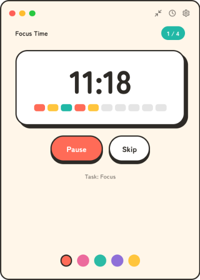
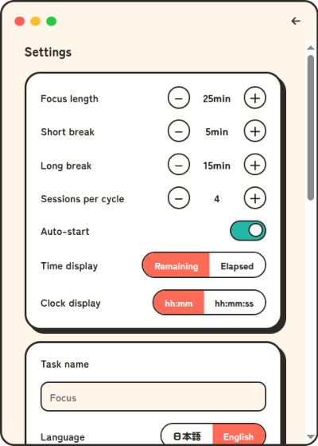
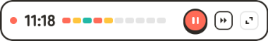

# 刻（kizami）

A tray-resident pomodoro timer with a candy-pop look.

kizami lives in your system tray / menu bar. Click the tray icon to open a small
frameless popup with the timer; close it and the timer keeps running in the
background. Desktop notifications tell you when it is time to take a break or
get back to focus.



## Features

- Classic pomodoro cycle: focus (25 min) → short break (5 min) × 4 sessions
  (adjustable), then a long break (15 min)
- Start / pause / resume / skip controls
- Tray-resident: the popup can be closed at any time, the timer keeps going
- Wall-clock based engine: survives window hiding and system sleep without drift
- Desktop notifications on every phase change
- Configurable durations, sessions per cycle, auto-start, task name
- Japanese / English UI (auto-detected from the OS locale, switchable in settings)
- Mini mode: shrink the popup to a slim bar with just the countdown and a
  start/stop button
- Clock mode: turn the popup into a desk clock (hh:mm or hh:mm:ss) with a
  bar showing how much of the day has passed, while the timer keeps running
- Custom window decoration, identical on Linux, macOS and Windows

## Screenshots

Durations, sessions per cycle, auto-start, time display, clock format, task
name, language, and the tray icon are all set from the settings view:



Mini mode shrinks the popup to a slim horizontal bar that stays out of the way:



## Development

Requirements: Node.js 22+ and npm.

```bash
npm install
npm run dev        # start with HMR (electron-vite)
```

Other commands:

```bash
npm run test       # unit tests (Vitest)
npm run lint       # ESLint + Prettier check
npm run format     # Prettier write
npm run build      # production build into out/
npm run dist       # package with electron-builder into release/
```

Development helpers:

- `node tools/demo-capture/shoot-shots.mjs` regenerates the screenshots in
  `docs/assets/` from the built app (see
  [tools/demo-capture/README.md](tools/demo-capture/README.md))
- `scripts/generate-icons.sh` regenerates tray/app icons from
  `logo/kizami-icon.paths.svg` (requires ImageMagick and librsvg)

## Architecture

- `src/main/` — Electron main process: wall-clock timer engine, tray, frameless
  popup window, settings persistence (electron-store), notifications, IPC
- `src/preload/` — context-isolated bridge exposing a typed `window.kizami` API
- `src/renderer/` — React UI (timer view / settings view)
- `src/shared/` — pure logic shared by both processes: timer state machine,
  settings sanitizer, i18n dictionaries — fully unit-tested

## License

MIT
